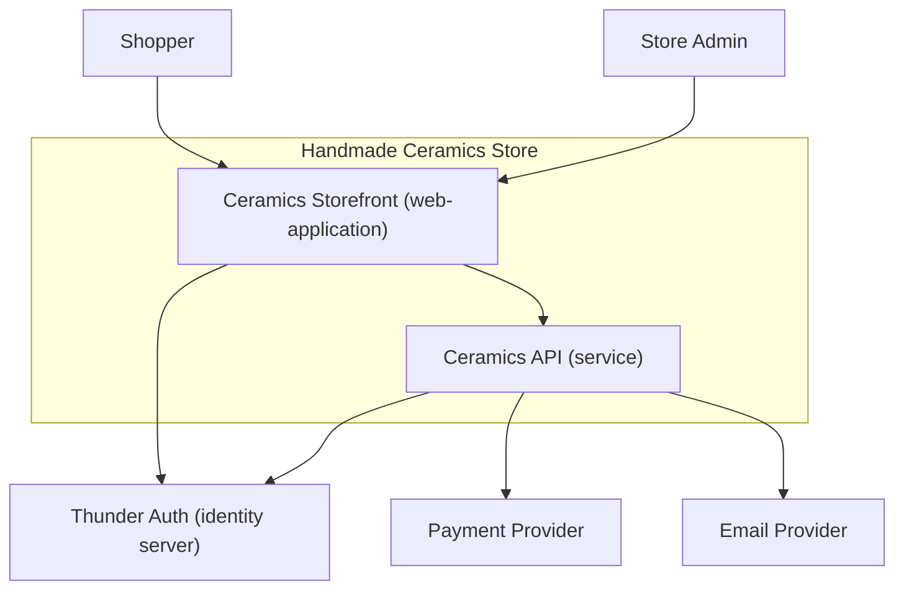
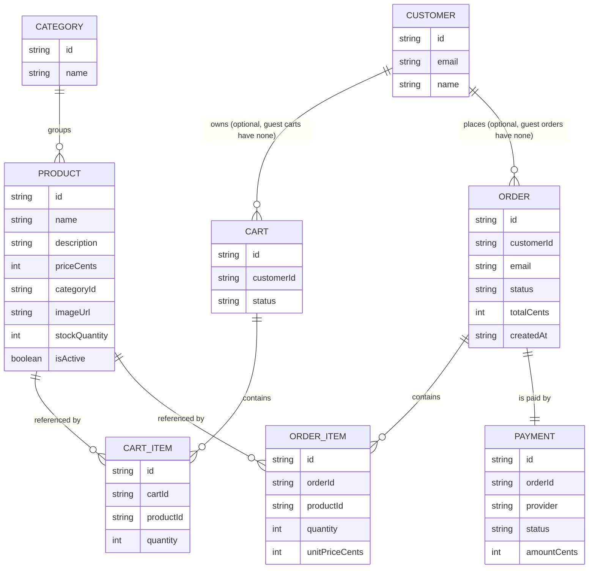
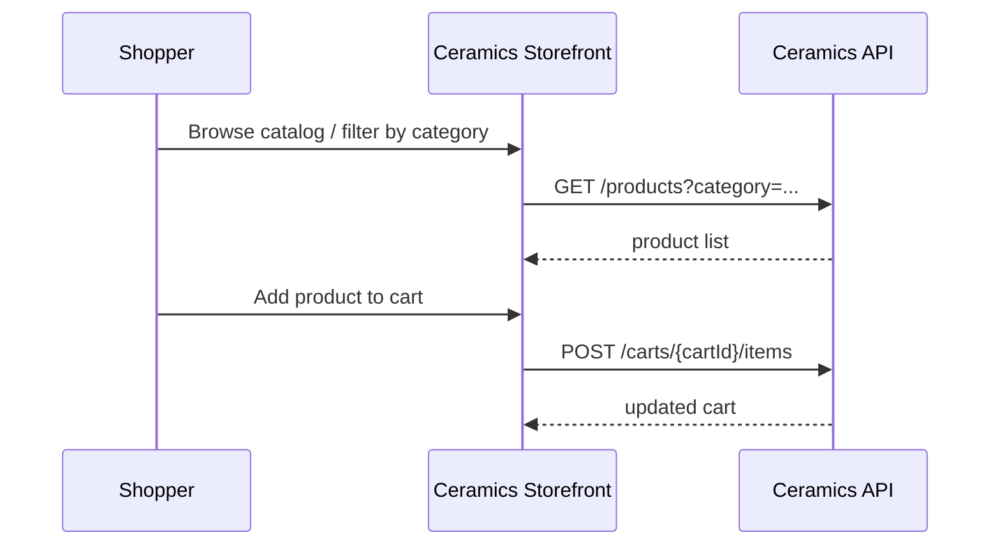
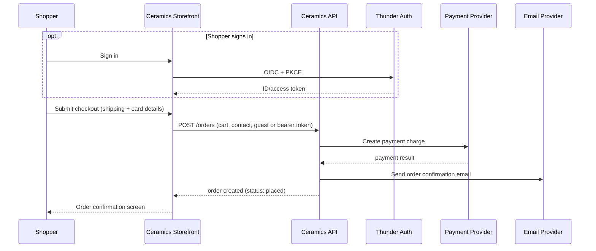
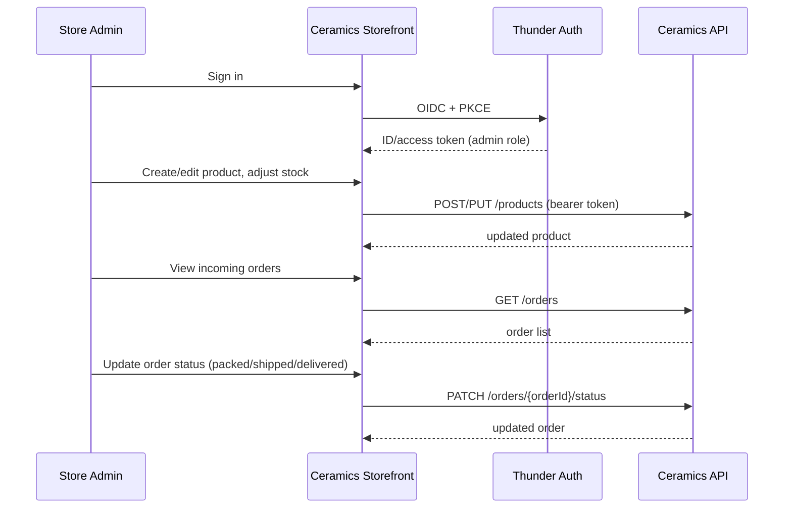

# Handmade Ceramics Store — Design

## Overview

A single-seller online store for handmade ceramics. Shoppers browse a product
catalog, build a cart, and check out (as a guest or signed in) with a card
payment; the store admin manages the catalog, inventory, and order
fulfillment. The system is one React storefront/admin web application backed
by one Ballerina API service, with sign-in via Thunder, card capture via a
third-party payment provider, and order-confirmation email via a transactional
email provider.

## Context (C1)

## Domain model (ER)

## Key flows

### Browse and add to cart

### Guest or signed-in checkout

### Admin manages catalog and fulfillment

